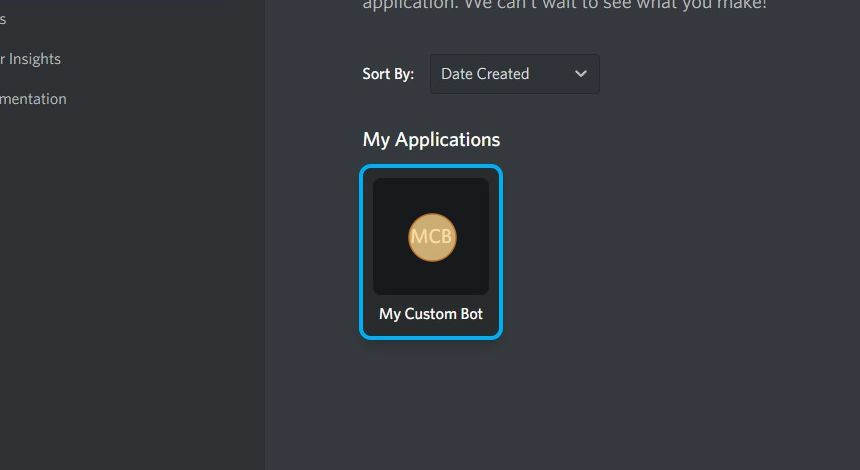
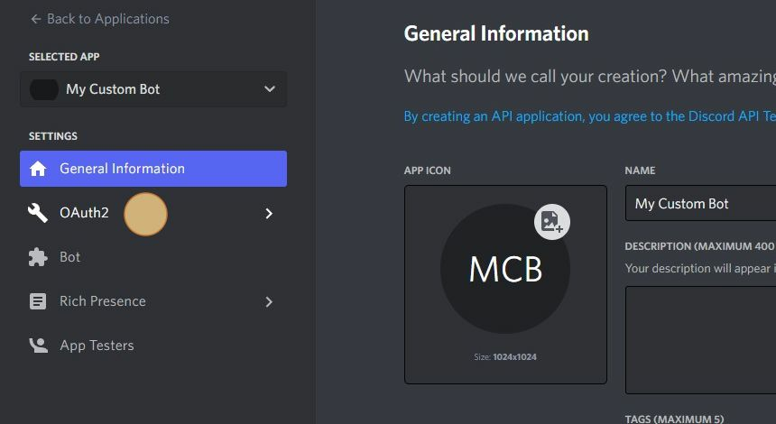
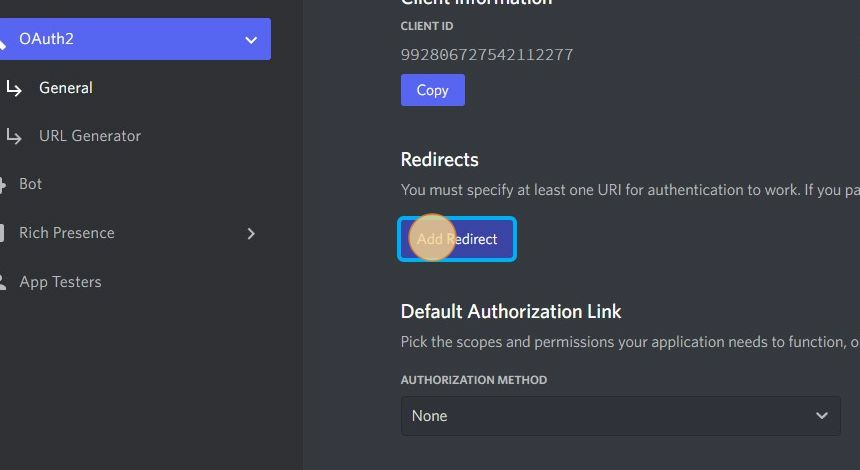
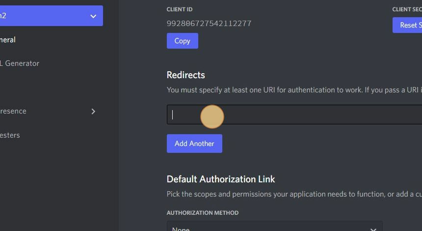
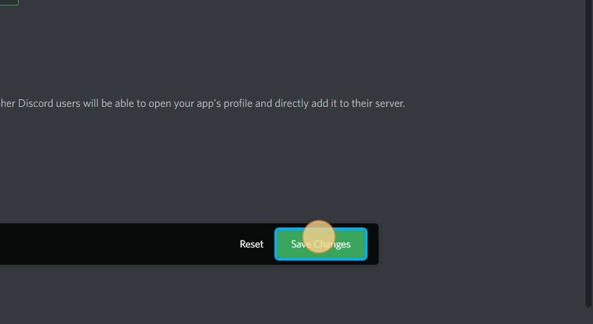

# How to add OAuth2 Link to your bot

**1. Navigate to https://discord.com/developers/applications**

**2. Select your Application**

**3. Click "OAuth2"**

**4. Click "Add Redirect"**

**5. Click this text field.**

**6. Type "<code>https://restorecord.com/api/callback</code>"**

**7. Click "Save Changes"**

