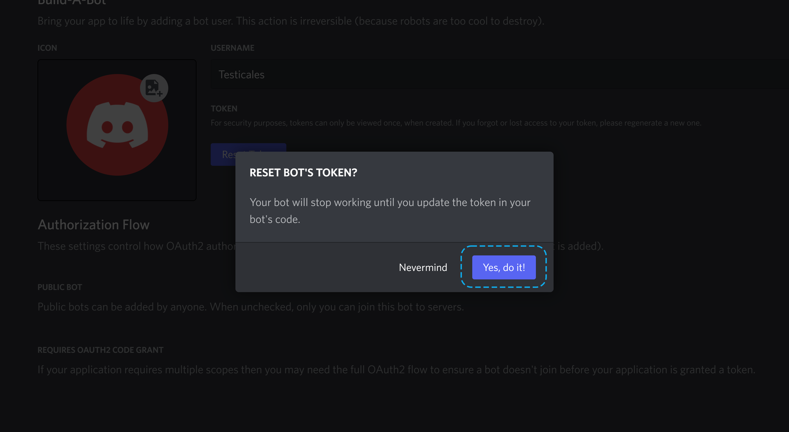
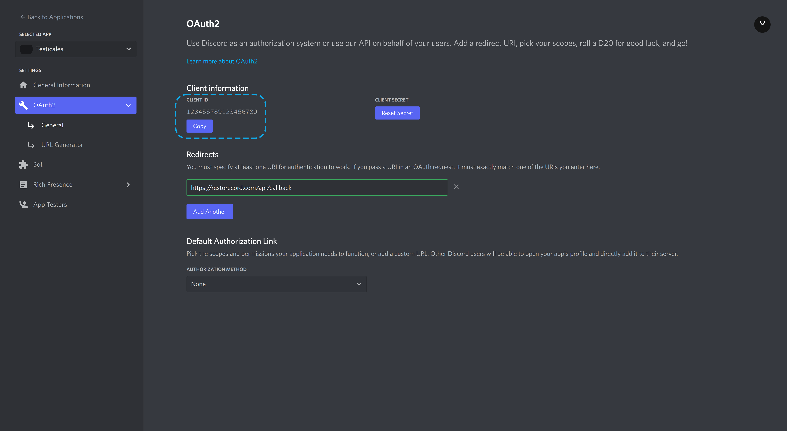
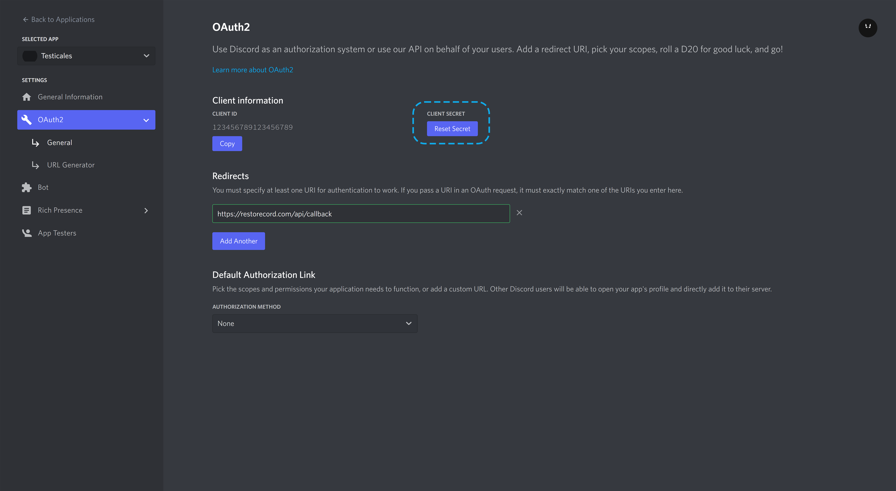
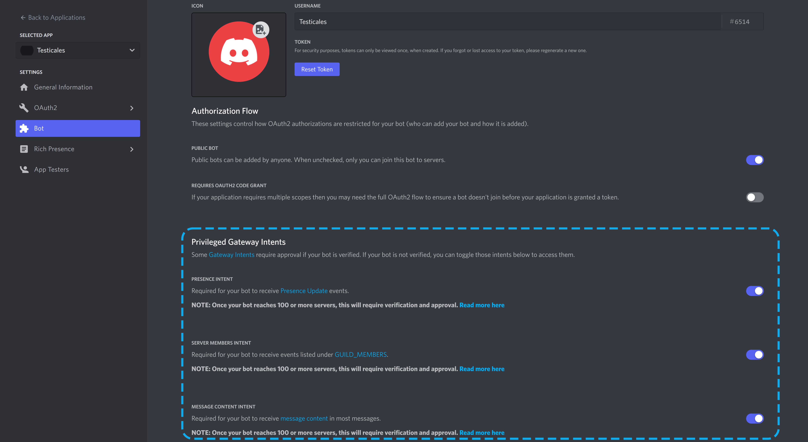
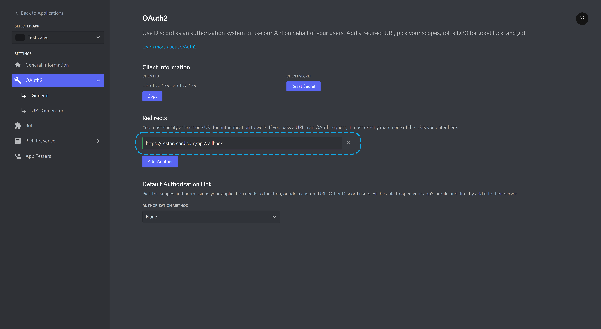

!!!warning
Due to security reasons, it's highly recommended to create an additional Discord Account for this step.
Read this before proceeding.
[!ref](/guides/secure-your-bot/#security-checklist)
!!!

## Create a bot

Head on over to the [Discord Developer Portal](https://discord.com/developers/applications){ target="_blank" } and click the **New Application** button in the top right of your screen.

Name it something not suspicious, do **NOT** include the word `RestoreCord` in your application name.

It is a good idea to place the bot in a team you've created and added many alternate accounts to, though at the bare minimum, ensure you create the bot on an account that has no relation to your server (not an admin or even a member).

After creating your application, click on the `Bot` tab on the left and then the **Add Bot** button on the right.

### Bot Token

After creating a Bot, click on the **Reset Token** button to reveal your bot's token.

Copy this token, and paste into the **Bot Token** field on the [dashboard](https://restorecord.com/dashboard/custombots){ target="_blank" } when you click the **Create New Bot** button.

### Client ID

Click on OAuth2 and copy the Client ID. Paste into the **Client ID** field on the [dashboard](https://restorecord.com/dashboard/custombots){ target="_blank" } when you click the **Create New Bot** button.

### Client Secret

Click on OAuth2, on the right-hand side of the screen, under **CLIENT SECRET**, click **"Reset Secret"**. Copy and paste in the **Client Secret** field on the [dashboard](https://restorecord.com/dashboard/custombots){ target="_blank" } when you click the **Create New Bot** button.

## Setup Privileged Gateway Intents

Setting up Privileged Gateway Intents might help your bot pull members faster and for future updates!

- Scroll down and toggle every Intent available:
  

## Setup OAuth2 Redirect

!!!warning
To prevent being banned if a RestoreCord ban wave occurs, it's highly recommended you setup a custom domain **(which can be done for free)**.
[!ref](/guides/custom-domain/)
!!!

||| **Redirect URL:**
https://restorecord.com/api/callback
|||

- After creating an application on the Discord Developer Portal](https://discord.com/developers/applications){ target="_blank" }, go to the `OAuth2` tab and add a Redirect URL.
  

!!!success Click "Save Changes"
You have successfully set up a redirect URL for custom bots.
!!!
