!!!warning
Due to security reasons, it is highly recommended to create an additional Discord Account for this step.
!!!

## Create a bot on Discord
Navigate to https://discord.com/developers/applications/

!!!info
Login if required.
!!!

Create a new application by clicking on **New Application**.
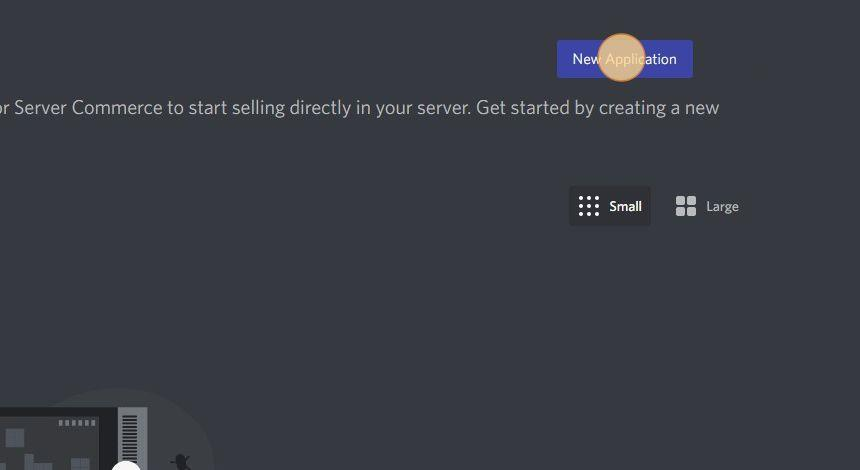
And give your Application an awesome name.

### Setup oAuth2 Redirect
After creating an Application, click on oAuth2.
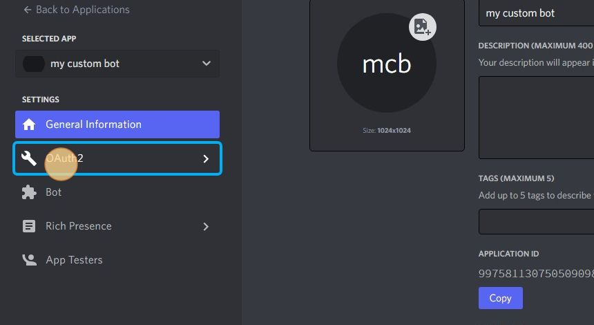

Then click on **Add Redirect**.
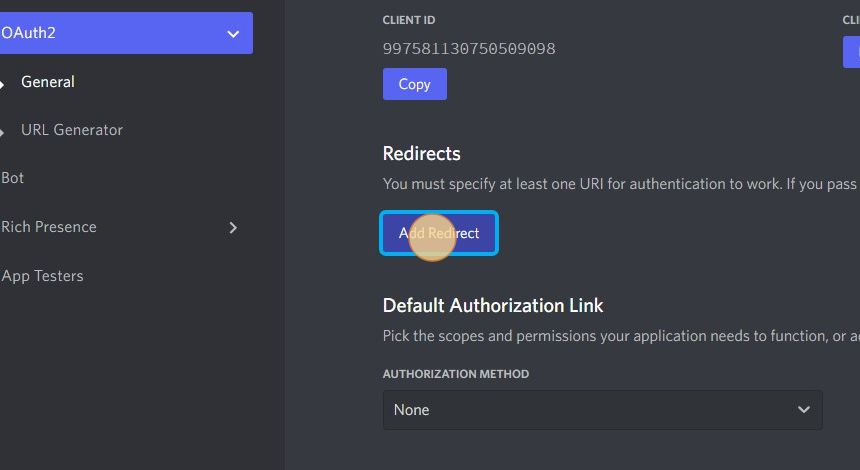

||| Redirect link:
https://restorecord.com/api/callback
|||

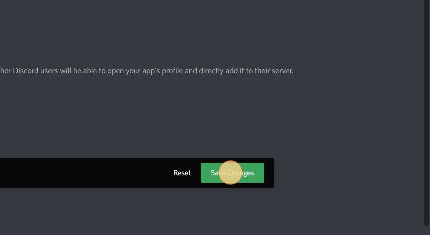

!!!warning Click "Save Changes"
You have successfully setup redirect url for custom bots.
!!!

## Find Further Information
Finding some required information about your bot might be hard, here a step-by-step guide:

### Bot Token
After creating a Bot, click on "Reset Token" to reveal its secret Tokens.
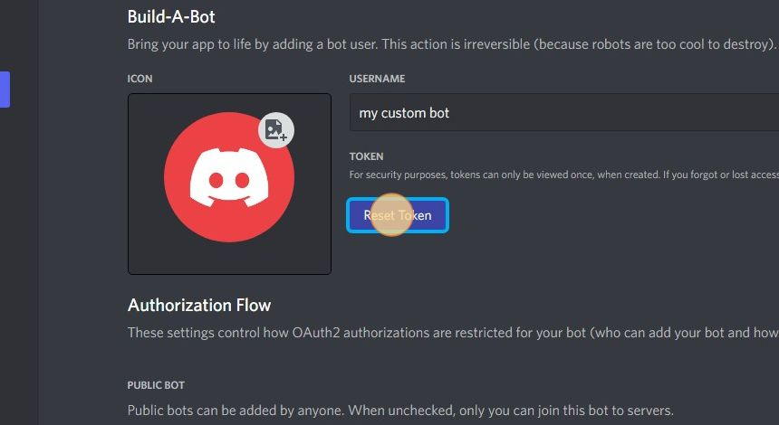
then copy the Token...
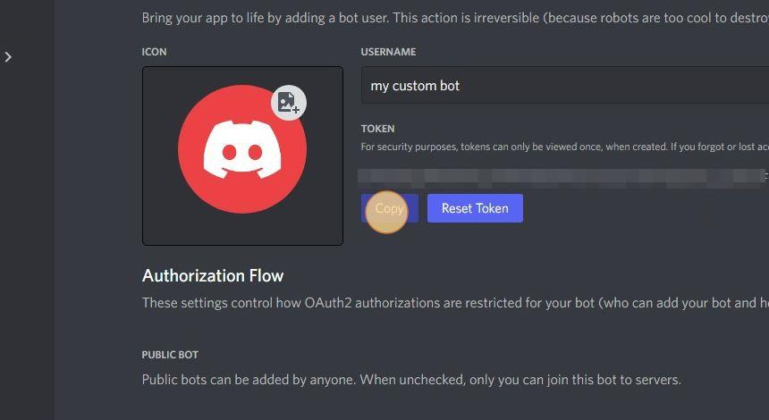

### Client ID
Click on oAuth2.
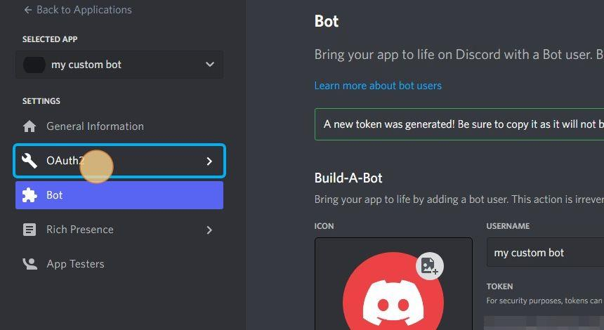
under CLIENT ID, click **Copy**...
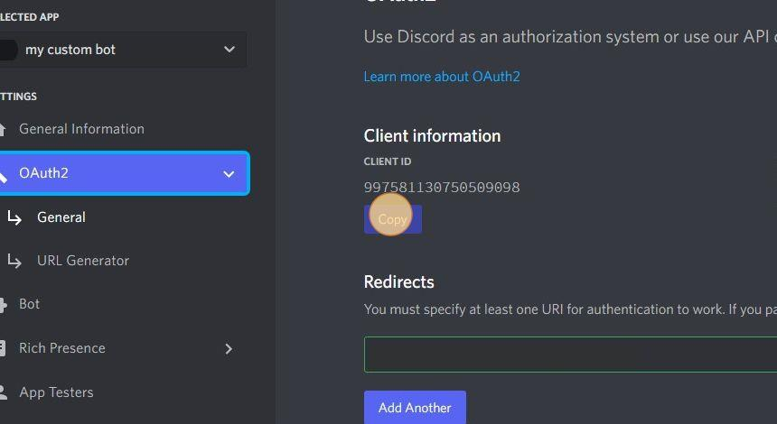

### Client Secret
Click on oAuth2, on the right hand side of the screen, under **CLIENT SECRET**, click **"Reset Secret"**.
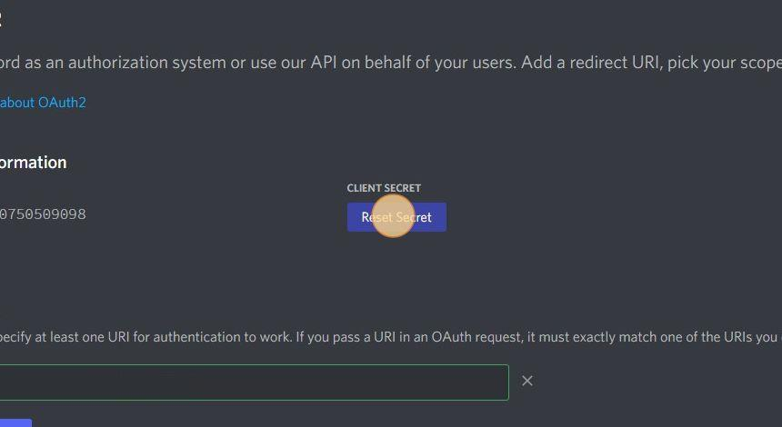
then copy the **CLIENT SECRET**
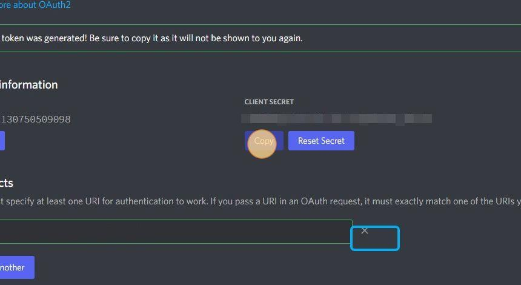

!!!success Woohoo!
Dora The Explorer found several information about their bot.
!!!

## Create a bot on RestoreCord

If you want to create a custom bot, you must fill out this form with the curresponding information:

- Bot Name
- ClientID
- Bot Token
- Bot Secret

!!!Primary Dont know where to find this information? Check this out!
[!ref](/guides/create-a-custom-bot/#find-further-information)
!!!

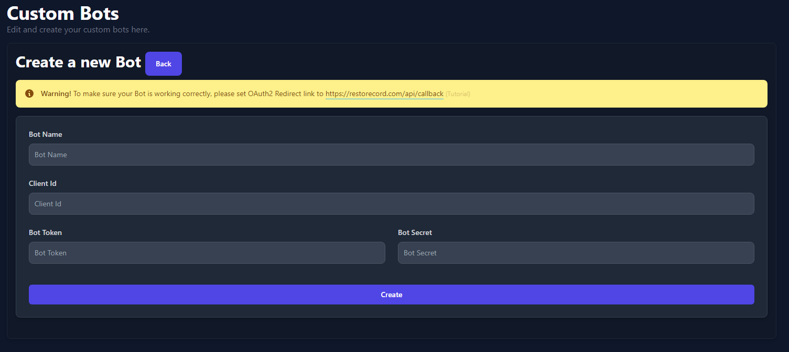

!!!warning
After filling out the form, don't forget to click on **Create**!
!!!

!!!success Congratulations!
You have completely setup a custom bot ready for RestoreCord.
!!!