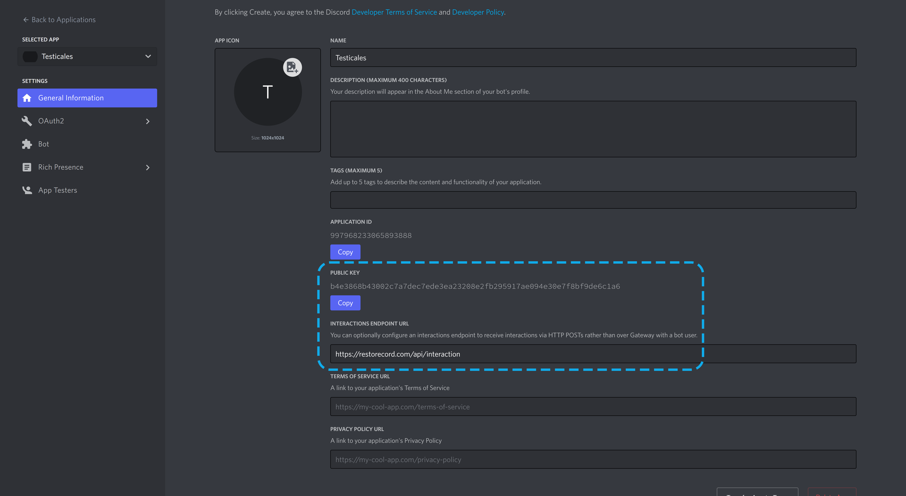

!!!warning
Due to security reasons, it is highly recommended to create an additional Discord Account for this step.
Read this before proceeding.
[!ref](/guides/secure-your-bot/#security-checklist)
!!!

### Setup Privileged Gateway Intents

Setting up Privileged Gateway Intents might help your bot pull members faster and for future updates!

- Scroll down and toggle every Intent available:
  

### Setup oAuth2 Redirect

||| **Redirect URL:**
https://restorecord.com/api/callback
|||

- After creating an Application on the [Discord Developer Portal](https://discord.com/developers/applications), go to the `OAuth2` tab and add a Redirect URL.
  

!!!success Click "Save Changes"
You have successfully set up a redirect URL for custom bots.
!!!

### Setup Interaction URL

!!!warning Business Plan Required
This feature is only available for Business Plan users, if you are not a Business Plan user, you can skip this step.
[!ref](https://restorecord.com/dashboard/upgrade)
!!!

This will allow your Bot to be online and be able to respond to commands.

- Edit your Custom Bot on the [Dashboard](https://restorecord.com/dashboard/custombots) and add the Public Key from the [Discord Developer Portal](https://discord.com/developers/applications) to the `Interaction URL` field.
  

  

||| **Interaction URL:**
https://restorecord.com/api/interactions
|||

!!!success Click "Save Changes"
You have successfully set up an Interaction URL for custom bots.
!!!

## Find Further Information

Finding some required information about your bot might be hard, here is a step-by-step guide:

### Bot Token

After creating a Bot, click on "Reset Token" to reveal its secret Tokens.

### Client ID

Click on OAuth2 and copy the Client ID.

### Client Secret

Click on OAuth2, on the right-hand side of the screen, under **CLIENT SECRET**, click **"Reset Secret"**.

