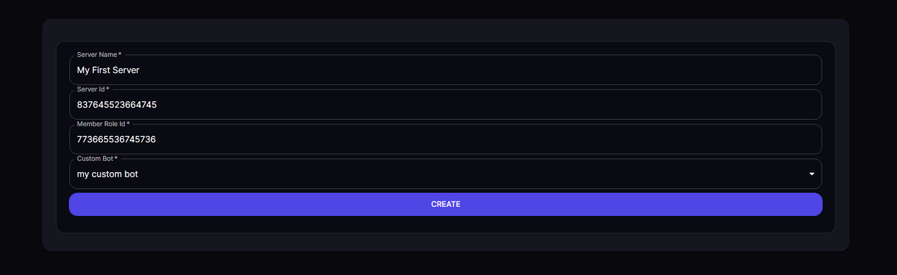
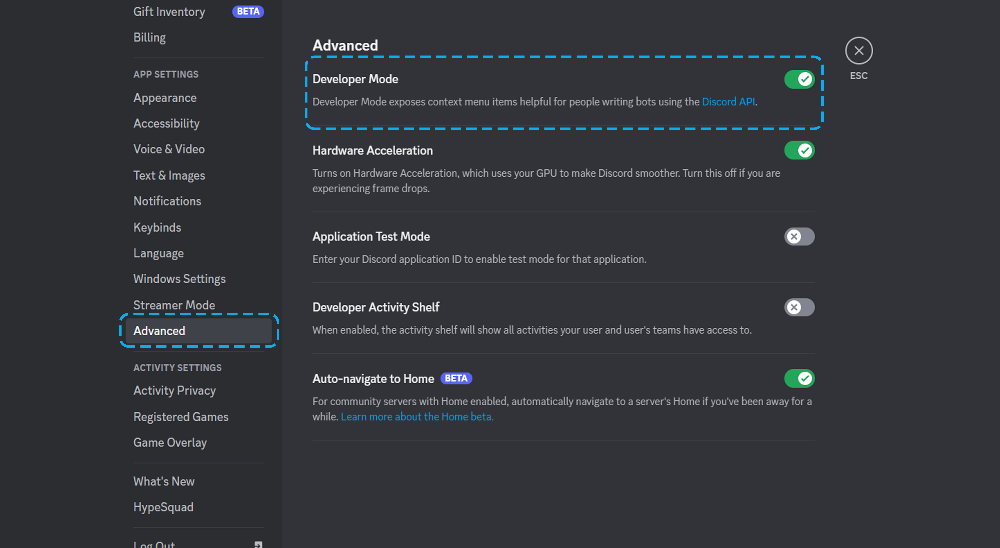
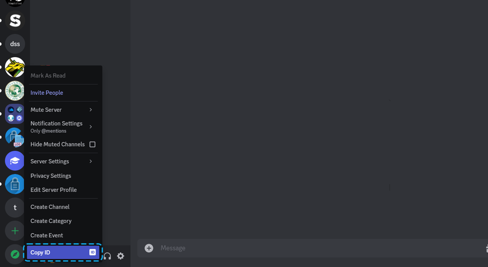
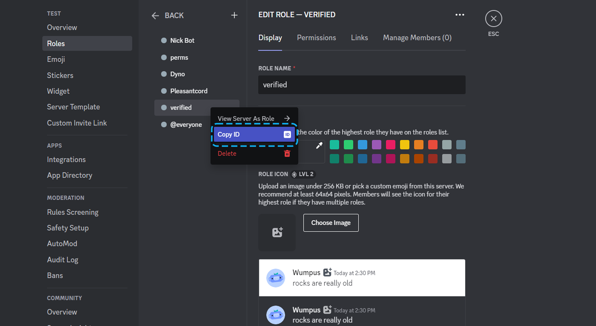

Navigate to the `Servers` tab of our [dashboard](https://restorecord.com/dashboard/server){ target="_blank" } and click on the **Create New Server** button.

## Choose a Server Name

The server name can be any available name on our service. It doesn't have to match your Discord server name.

The server name is shown to users when they verify and is part of your verification URL `https://restorecord.com/verify/<server-name>`

## Enable developer mode

To advance to the next steps, we need to enable **Discord Developer Mode** to copy some Discord IDs. 

Please navigate to your Discord settings, then the `Advanced` tab where you'll toggle **Developer Mode** to be enabled.

## Copy server/guild ID

Scroll through your Discord server list until you see your Discord server.

Right-click your Discord server's icon and click the **Copy ID** button. Paste into the **Server Id** field on the [dashboard](https://restorecord.com/dashboard/server){ target="_blank" } when you click the **Create New Server** button.

## Copy role ID

Create a role in your Discord server. This is the role your members will receive upon completing verification. Think of it as a `verified` role, though you can name it whatever you'd like.

Right-click on the role's name and click the **Copy ID** button. Paste into the **Member Role Id** field on the [dashboard](https://restorecord.com/dashboard/server){ target="_blank" } when you click the **Create New Server** button.

!!!warning Bot Role
<u>Make sure that the role of the Bot is higher than the verified/member role.</u>

!!!

## Specify Custom Bot

You should've already created and configured a bot on the latter page. If not, please do so now.

[!ref Setup a Custom Bot](/guides/create-a-custom-bot/)

Choose the bot you'd like your members to verify with for this particular server. You likely want it to have the same branding as your server so your members aren't confused.

It is recommended that if you have multiple servers, you have a separate bot owned by a separate account for each to diversify risk.

!!!success Congratulations!
You have successfully created a server on RestoreCord
!!!
