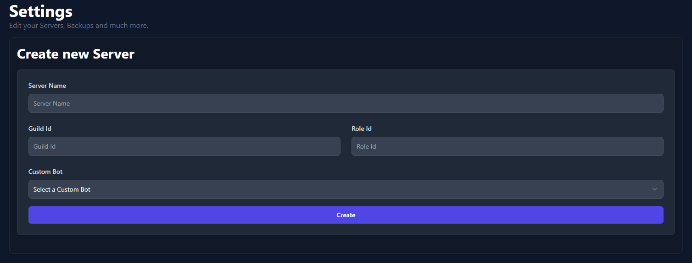

# How to create a server on RestoreCord.

Navigate to https://restorecord.com/dashboard/settings and create a new server.
Then fill out the requested information:
- Server Name
- GuildId / ServerID
- Role ID (The role the user received when they verify)
- Choose the custom bot you want to use for this server.
!!!warning
After filling out the form, don't forget to click on **Create**!
!!!

!!!success Congratulations!
You have successfully created a server on RestoreCord
!!!