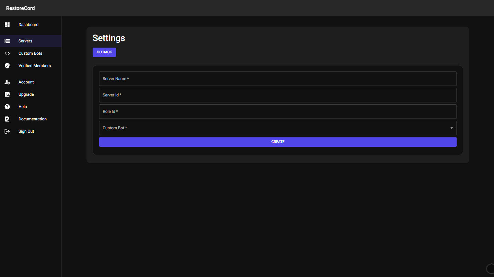
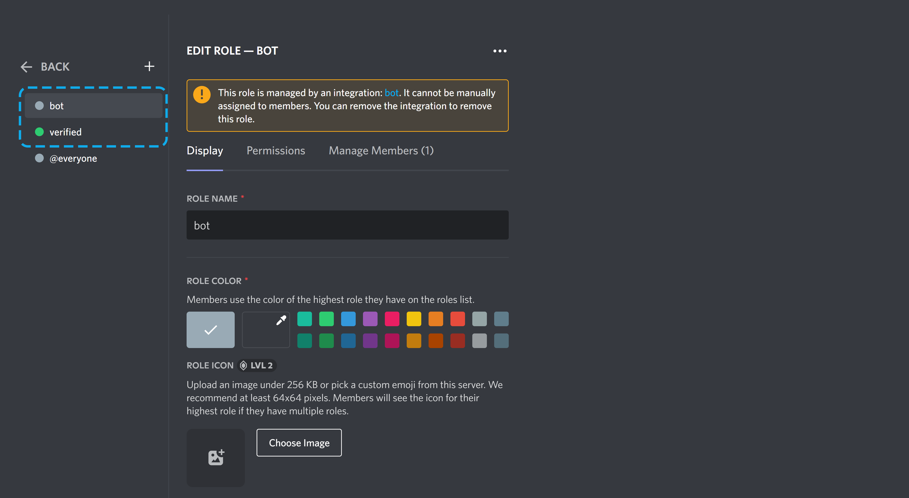

Navigate to the [Servers Dashboard](https://restorecord.com/dashboard/settings) and click on the `Create New Server` button.
Then you will be asked to enter the following information:

- Server Name
- Guild Id / Server Id
- Role Id (The role the user received when they verify)
- Choose the custom bot you want to use for this server <b style="color: #ff3232; text-decoration: underline">( You can't change this later! )</b>

!!!warning Bot Role
<u>Make sure that the role of the Bot is higher than the verifed/member role.</u>

!!!

!!!success Congratulations!
You have successfully created a server on RestoreCord
!!!
