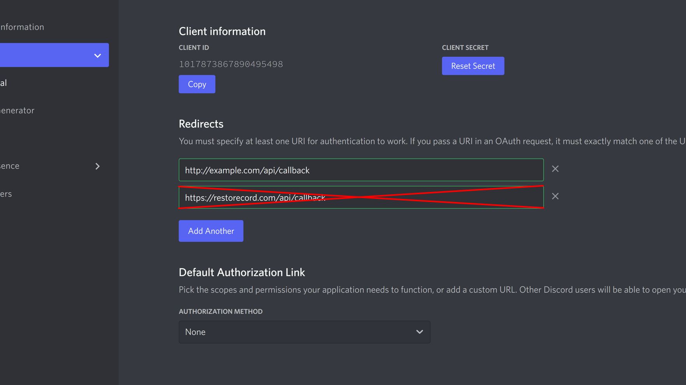

## What is a Custom Domain?

A Custom Domain is a domain name that you can use as an `redirect_url` for your custom bot. This allows you to use your own domain name instead of the RestoreCord domain name.

## Why is it important?

Discord is still able to link all RestoreCord bots together, even if you use a custom domain. This is because RestoreCord uses the same domain name for all bots. This means that if you use a custom domain, you will be able to hide the fact that you are using RestoreCord.

## How do I set up a Custom Domain?

To set up a Custom Domain, you will need to have a domain name and a Cloudflare account. If you do not have a domain name, you can purchase one from [Namecheap](https://www.namecheap.com/), [GoDaddy](https://www.godaddy.com/), or [Google Domains](https://domains.google/).

### Step 1: Set up Cloudflare

To set up Cloudflare, you will need to create an account on [Cloudflare](https://www.cloudflare.com/). Once you have created an account, you will need to add your domain name to Cloudflare. You can do this by clicking on the `Add a Site` button.


### Step 2: Set up Page Rules

Once you have added your domain name to Cloudflare, you will need to set up Page Rules. To do this, you will need to look on the left side of the screen and click on the [`Page Rules`](https://dash.cloudflare.com/?to=/:account/:zone/rules) button.

You have to create a Page Rule for your domain, replace `example.com` with your domain name.

||| **URL:**

```
example.com/api/callback?code=*&state=*
```

|||

||| **Enter destination URL:**

```
https://restorecord.com/api/callback?code=$1&state=$2
```

|||


### Step 3: Setup Discord Redirect URL

Once you have set up Cloudflare, you will need to set up your Discord Redirect URL. To do this, you will need to go to the [Discord Developer Portal](https://discord.com/developers/applications) and select your bot. Once you have selected your bot, you will need to go to the `OAuth2` tab and scroll down to the `Redirects` section.

You will need to add `https://example.com/api/callback` to the `Redirects` section. Replace `example.com` with your domain name.



### Step 4: Setup RestoreCord Custom Domain

Once you have set up your Discord Redirect URL, you will need to set up your RestoreCord Custom Domain. To do this, you will need to go to the [RestoreCord Dashboard](https://restr.co/bots) and select your bot. Once you have selected your bot, you will need to go to click on the `Edit` button, and scroll down to the `Custom Domain` section.

You will need to add `example.com` to the `Custom Domain` section. Replace `example.com` with your domain name.


!!! success Done!
You have successfully set up a Custom Domain for your bot. You can now use your own domain name instead of the RestoreCord domain name.
!!!
