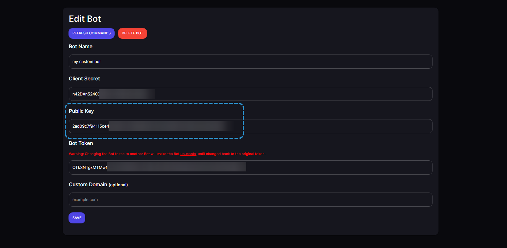

!!!warning Business Plan Required
**This feature is only available for Business Plan users, if you are not a Business Plan user, you can skip this step.**
[!ref Upgrade Account](https://restr.co/upgr)
!!!

This will allow your Bot to be online and be able to respond to commands.

- Edit your Custom Bot on the [Dashboard](https://restr.co/bots) and add the Public Key from the [Discord Developer Portal](https://discord.com/developers/applications) to the `Public Key` field.
  

  ||| **Interaction URL:**

  ```
  https://restorecord.com/api/interaction
  ```

  |||
  

!!!success Click "Save Changes"
You have successfully set up an Interaction URL for custom bots, you can now use Slash Commands and your Bot will be online.
!!!
