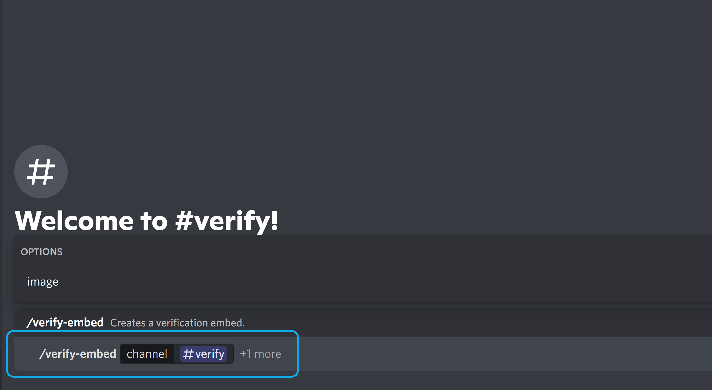
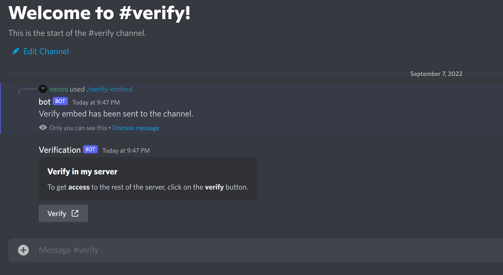

!!!info Business Plan required
This feature is only available on the Business Plan. If you want to upgrade your plan, goto the [Upgrade](https://restorecord.com/dashboard/upgrade) page.
!!!

### Invite your bot

If you haven't invited your Bot with the `applications.commands` scope, you can do so by clicking on the `Invite` button on the [Dashboard](https://restorecord.com/dashboard/custombots).

### Send the verify message

To send the verify message, you can use the `/verify-embed` command in your server, the command requires the following the `channel` argument.

```
/verify-embed channel:#verify
```



If you like to add an Image to the embed, you can use the `image` argument.

```
/verify-embed channel:#verify image:https://example.com/image.png
```


